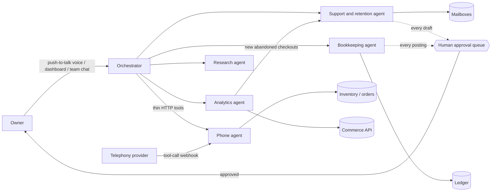

# Running a fleet of LLM agents for a real business: field notes

This is a written account of a small fleet of LLM agents that has run a one-location
retail business's back office since August 2026: the phone, the support inbox,
retention email, bookkeeping, merchandising analytics, and research. It is the design,
the operating rules, and the incidents that produced them. The code is private because
it holds the business's credentials and customer data and is wired into live systems.
The evaluation harness for the phone agent is public at
[llm-agent-evals](https://github.com/peterzemore/llm-agent-evals), and the recommender
that grew out of the analytics work is at
[basket-recommender](https://github.com/peterzemore/basket-recommender).

Identifying details are left out on purpose: no business name, addresses, numbers,
hostnames, ports, or people other than me.

## The fleet

| Agent | Job | Acts on its own? | What always needs a human |
|---|---|---|---|
| Orchestrator | Voice and chat front door to the others; relays standing instructions | Never, except scheduled reminders and a daily report | Everything else |
| Phone agent | Answers the store's phone: stock lookups, order status, hours, buy/sell policy, callback requests | Yes, live on every call | Nothing at call time; every fix is pinned as an eval case |
| Support and retention agent | Triages two support inboxes, drafts replies, drafts win-back campaigns | Reads and drafts only | Every send |
| Bookkeeping agent | Ingests bank statements and bills into a double-entry ledger, syncs sales from the commerce platform | Deterministic syncs only | Every categorized posting |
| Analytics agent | Co-purchase, ABC velocity, margin and discount audits, abandoned-checkout detection, live from the commerce API | Runs on a schedule, hands abandons to the retention agent | Any customer-facing follow-up |
| Research agent | Plans queries, searches, scrapes, writes a cited report on a topic | On request | Reading the report |

Each agent is its own process with its own persona files, scheduler, credentials, and
notes file. The orchestrator talks to them over HTTP and never imports their code.

## Design rules

These are the rules the fleet actually runs under. Each one was either decided up front
or written down after something went wrong; the incidents section says which.

1. **One process per agent, and no shared scheduler.** Each agent owns its own
   recurring behavior. The orchestrator is deliberately scheduler-less so that "it
   never speaks unless spoken to" stays true by construction. The only exceptions are
   reminders and one daily report, and those live in a separate bridge process, not in
   the orchestrator.

2. **One chat engine, layered personas.** A single module builds the model call,
   system instruction, and tool list for every scope: voice, dashboard, team chat, and
   a broadcast mode where several agents answer one question in turn. Persona comes
   from three small files per agent, an identity, a set of values, and notes about the
   user, concatenated ahead of the operational instructions. A team-chat-only
   personality layer sits on top of that and never replaces the working voice.

3. **Tools are thin HTTP wrappers.** The orchestrator's tools each call one endpoint on
   one agent. That keeps the agents decoupled across separate repositories and virtual
   environments, and it means an agent can be restarted or replaced without touching
   the orchestrator.

4. **Anything outbound goes through a review queue.** Email drafts, campaign drafts,
   and ledger postings land in a queue and wait for explicit approval. The
   orchestrator's own instructions forbid approving a bill except on a clear go-ahead
   for that specific item. Deterministic syncs, where the code is the same code a
   button in the app would run, bypass the queue because there is no judgment in them.

5. **Least privilege per agent, and one credential per agent.** The phone agent's
   commerce credential can read orders and nothing else, obtained after finding it had
   inherited a write-capable token from a tooling project. The analytics agent has its
   own read-only app. The retention agent sends bulk mail from a separate alias so a
   spam complaint never touches the support mailboxes.

6. **Local by default.** Every agent server binds to the loopback interface. The one
   public surface, the phone agent's tool-call webhook, requires a shared secret on
   every request, and that secret has to be configured in every place the telephony
   provider can originate a call from, which turned out to be five.

7. **A draft may only state facts it was given.** Written into the retention agent's
   own notes after it invented a membership benefit in a campaign draft. Two rounds of
   redrafting were needed before this became a rule rather than a correction.

8. **Standing directives are a file, not a prompt edit.** "Tell the analytics and
   bookkeeping agents the revenue goal is X" is delivered by the orchestrator writing
   to each agent's directives file through an endpoint, and each agent reads it on
   every turn. The owner can set and inspect them by voice.

## Operating it

The whole fleet runs as user-level systemd services on a single desktop, with a
consumer GPU handling local speech-to-text for the voice loop. Text-to-speech is local
too. The voice loop and the dashboard are the two things not under systemd, on purpose:
both are interactive.

Three operational lessons, all learned the hard way:

- **Nothing was persistent until a scheduled report failed to arrive.** For the first
  week the agents ran in whatever terminal had last started them. A morning sales
  report silently did not fire because the process happened not to be running. A
  thorough search of the journal, unit files, cron, tmux, and containers confirmed
  nothing had ever supervised them. They went under systemd the same day.

- **A watchdog timer, because `Restart=on-failure` does not cover a clean stop.** Three
  services died at the exact same second one evening with clean termination signals
  and no "Stopping" line in the journal, meaning whatever sent the signals bypassed
  systemd's own stop path. Root cause is still unknown. A five-minute timer now checks
  every unit and starts any that are down, and it has caught real drops since.

- **Paths with spaces break `ExecStart=` silently.** Interpreter paths containing
  spaces produced `203/EXEC` until quoted; `WorkingDirectory=` needs no quoting because
  it is not word-split; and start-limit settings placed in the wrong section are
  ignored with only a log warning. A recreated unit file had an orphaned earlier
  process squatting on its port, which read as a failed restart until the old process
  was found and killed.

## Incidents that shaped the rules

**Two agent servers were listening on all interfaces with no authentication.** Found
while answering a question about home-network security, not by an alert. One of the
endpoints exposed could post real ledger entries. Both were rebound to loopback the same
day. Rule 6 comes from this.

**The retention agent "hung" on startup.** It looked like blocked I/O and the first fix
was a timeout, which was a reasonable guess and wrong. Timing each step showed every
mail-server call completing in under a second. The real cause was a backlog of 49
unprocessed messages, each needing a model call, combined with scan progress being saved
only at the end of the whole batch, so every restart mid-scan, including the ones caused
by chasing the wrong theory, re-did all 49 from zero. Saving after every message and
backgrounding the startup scan fixed it. The general lesson, measure the failing step
before patching a plausible cause, became a reusable checklist I now keep as a public
skill.

**Over a thousand retention emails had gone out with no unsubscribe mechanism.** Noticed
mid-session, weeks in. A suppression list was built the same session, an unsubscribe
request is now actioned immediately and unconditionally without waiting for the queued
confirmation to be approved, and every campaign carries the required footer. This is
the incident I am least proud of and the one most worth writing down.

**A campaign draft invented a benefit.** "Shopping again keeps your membership active"
was false; the free tier is opt-in based. It also baked in a price nobody had stated.
Rule 7.

**The phone agent's bugs were all fluent sentences.** A spoken phone number stored as
its last seven digits with a callback promised; a policy denial for a question the
agent had no facts about; the store's web address said two different ways because tool
results are relayed nearly verbatim. None raised an error. All were found by calling the
agent and listening, and each was pinned as a regression case before the fix counted.
That workflow is the evaluation repo.

**A phone webhook returned 401 in production for a whole tool** because the new tool's
route had not been given the shared secret in one of the telephony provider's five
configuration places. Rule 6, second half.

## What I would do differently

- Put every agent under a supervisor on day one, with the watchdog. The first week of
  "it was running yesterday" cost more than the setup would have.
- Build the unsubscribe path before the first campaign, not after the thousandth email.
- Write the evaluation cases from real calls from the start. The harness existed for
  days before the two calls that found the bugs that mattered.
- Give each agent its own credential from the start rather than copying one that
  already worked. Every over-scoped token in this fleet was copied from a project that
  legitimately needed the scope.
- Keep a per-agent notes file from the first commit. The single most useful artifact in
  this fleet is the set of notes files that say why each rule exists.

## What is deliberately not here

Business name and location, phone numbers, mailbox addresses, hostnames and ports,
credential names, customer or staff details, message contents, revenue figures, and
code. The patterns are the point; the specifics are someone's business.
